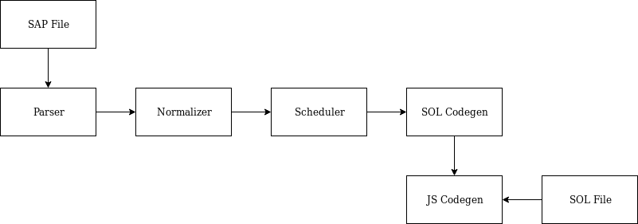

---
header-includes:
  - \usepackage{tikz}
  - \usepackage{booktabs}
  - \usepackage{listings}
---

\setmonofont{FantasqueSansMono Nerd Font}

\makeatletter

\patchcmd{\lsthk@SelectCharTable}{%
  \lst@ifbreaklines\lst@Def{`)}{\lst@breakProcessOther)}\fi
}{%
}{
}{
}

\makeatother

\newcommand{\CodeSymbol}[1]{\textcolor{cyan!50!black}{#1}}

\lstset{
basicstyle=\footnotesize\ttfamily\bfseries\color{red},
keywordstyle=\color{green!50!black},
keywordstyle=[2]\color{red!50!black},
keywordstyle=[4]\color{red},
stringstyle=\color{yellow!80!black},
commentstyle=\itshape\color{gray!50!white},
identifierstyle=\color{cyan!50!black},
literate={\{}{{\CodeSymbol{\{}}}1
               {\}}{{\CodeSymbol{\}}}}1
               {(}{{\CodeSymbol{(}}}1
               {)}{{\CodeSymbol{)}}}1
               {=}{{\CodeSymbol{=}}}1
               {;}{{\CodeSymbol{;}}}1
               {.}{{\CodeSymbol{.}}}1
               {:}{{\CodeSymbol{:}}}1
               {|}{{\CodeSymbol{|}}}1
               {,}{{\CodeSymbol{,}}}1
               {-}{{\CodeSymbol{-}}}1
               {>}{{\CodeSymbol{>}}}1
               {1}{{\CodeSymbol{1}}}1
               {2}{{\CodeSymbol{2}}}1
               {3}{{\CodeSymbol{3}}}1
               {4}{{\CodeSymbol{4}}}1
               {5}{{\CodeSymbol{5}}}1
               {6}{{\CodeSymbol{6}}}1
               {7}{{\CodeSymbol{7}}}1
               {8}{{\CodeSymbol{8}}}1
               {9}{{\CodeSymbol{9}}}1
               {0}{{\CodeSymbol{0}}}1
}

\lstdefinelanguage{JavaScript}{
morekeywords={break,case,catch,continue,debugger,default,delete,do,else,finally,
  for,function,if,in,instanceof,new,return,switch,this,throw,try,typeof,var,void,while,with,
  node, var, in},
morekeywords=[2]{class,enum,export,extends,import,super,implements,interface,let,package,private,protected,public,static,yield},
morekeywords=[3]{prototype},
morestring=[b]{"},
morestring=[b]{'},
morecomment=[l]{//},
morecomment=[s]{/*}{*/},
morecomment=[s][\color{black}]{<}{>}
}

\lstset{language=Javascript}
\lstset{basicstyle=\footnotesize\ttfamily,breaklines=true}

The SMUDGE compiler is comprised of six passes:

* Parsing
* Clock checking
* Scheduling
* Normalization
* Sol codegen
* Javascript codegen

Each output is fed as input to the following pass.

For debug purposes, build artifacts are created in the `build/` folder.
As such, we can find the following files in `build/`:

* name.sap
* name.clk
* name.scheduled
* name.nsap
* name.sol

If no `-o name` parameter is given, the compiler outputs the Javascript code
in `out.js`

## Scheduler

For more ease of use, SaP users are allowed to write their equations
in whichever order they like. As such, there should be no noticeable difference in
the execution of the following snippets.

\begin{table}[!h]
\begin{minipage}{0.45\linewidth}
\begin{lstlisting}
node example() -> (x: int) with
  x = y + 1;
  y = 2
\end{lstlisting}
\end{minipage}
\hfill\vrule\hfill
\begin{minipage}{0.45\linewidth}
\begin{lstlisting}
node example() -> (x: int) with
  x = y + 1;
  y = 2
\end{lstlisting}
\end{minipage}
\end{table}

This is the task of the Scheduler. We'll explain its operation using the following
snippet as example.

\lstset{basicstyle=\ttfamily\normalsize}
\begin{lstlisting}
node example() -> (x: int) with
  a = whatev(x);
  z = 3 fby plus(z, 1);
  b = 2 fby 1;
  x = plus(z, y);
  (c, d) = (x, y);
  y = 2
\end{lstlisting}
\lstset{basicstyle=\ttfamily\footnotesize}

#### TL;DR
The scheduler must find dependencies between equations. In order to do so,
it runs through node equations to find references to variables defined in-node.
It has to check for circular dependency, and reorganize equation order based on
those factors. We implement this by using graph algorithms.

Firstly, the scheduler builds an Hashmap containing the equations with the ids as
index. 

\begin{table}[!htbp]
\centering
\begin{tabular}{ll}
id & equations                      \\
\midrule
a  & a = op(x)                      \\
z  & z = 3 fby plus(z, 1)           \\
b  & b = 2 fby 1                    \\
x  & x = plus(z, y)                 \\
c  & (c, d) = (x, y)                \\
d  & (c, d) = (x, y)                \\
y  & y = 2                          \\
\bottomrule
\end{tabular}
\caption{Hashtable Contents}
\end{table}

The scheduler then establishes a list of ids that could be depended upon.
This is to exclude input variables and delays. Indeed, input variables would
not be present in the equations. We treat equations of the form `x = v fby a`
as in this case `x` is a memory and thus must be scheduled after every computation
reading variable `x`.

\begin{table}[!htbp]
\centering
\begin{tabular}{|l|l|l|l|l|}
\hline
a & x & c & d & y \\ \hline
\end{tabular}
\caption{Id List}
\end{table}

The scheduler then moves on to creating the dependency graph. First, it adds a vertex
for each id that isn't deducted from a delay expression.

Secondly, it adds an edge for each reference to an id in the right-hand side of the equation.
For example, it would add an edge between `a` and `x`. We are presented with the following
graph.
\newline

{width=40%}

Once the dependency graph is in our possession, we can do a causality check.
Indeed, a schedule only exists if the graph is acyclic. If no cycle is found,
the scheduler moves on to reordering.

The scheduler then traverses the graph in order to find a vertex that has no
successors, that is to say that eq has no more unsatisfied dependencies.
When one is found, it is added to the ordered list, and the vertex is deleted.
The scheduler goes on recursively until no vertex is left.

We are left with the following arrangement.

\lstset{basicstyle=\ttfamily\normalsize}
\begin{lstlisting}
node test() -> () with
  y = 2;
  x = plus(z, y);
  a = whatev(x);
  (c, d) = (x, y);
  z = 3 fby plus(z, 1);
  b = 2 fby 1
\end{lstlisting}
\lstset{basicstyle=\ttfamily\footnotesize}
