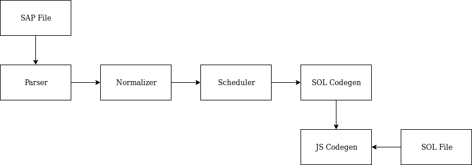

\newpage

\setmonofont{FantasqueSansMono Nerd Font}

\makeatletter

\patchcmd{\lsthk@SelectCharTable}{%
  \lst@ifbreaklines\lst@Def{`)}{\lst@breakProcessOther)}\fi
}{%
}{
}{
}

\makeatother

\newcommand{\CodeSymbol}[1]{\textcolor{cyan!50!black}{#1}}
\newcommand{\CodeSymbolPurple}[1]{\textcolor{purple}{#1}}

\lstset{
basicstyle=\footnotesize\ttfamily\bfseries\color{red},
keywordstyle=\color{green!50!black},
keywordstyle=[2]\color{red!50!black},
keywordstyle=[3]\color{purple},
keywordstyle=[4]\color{red},
stringstyle=\color{yellow!80!black},
commentstyle=\itshape\color{gray!50!white},
identifierstyle=\color{cyan!50!black},
literate={\{}{{\CodeSymbol{\{}}}1
               {\}}{{\CodeSymbol{\}}}}1
               {(}{{\CodeSymbol{(}}}1
               {)}{{\CodeSymbol{)}}}1
               {=}{{\CodeSymbol{=}}}1
               {;}{{\CodeSymbol{;}}}1
               {.}{{\CodeSymbol{.}}}1
               {:}{{\CodeSymbol{:}}}1
               {|}{{\CodeSymbol{|}}}1
               {,}{{\CodeSymbol{,}}}1
               {-}{{\CodeSymbol{-}}}1
               {1}{{\CodeSymbol{1}}}1
               {2}{{\CodeSymbol{2}}}1
               {3}{{\CodeSymbol{3}}}1
               {4}{{\CodeSymbol{4}}}1
               {5}{{\CodeSymbol{5}}}1
               {6}{{\CodeSymbol{6}}}1
               {7}{{\CodeSymbol{7}}}1
               {8}{{\CodeSymbol{8}}}1
               {9}{{\CodeSymbol{9}}}1
               {0}{{\CodeSymbol{0}}}1
               {->}{{\CodeSymbol{->}}}1
}

\lstdefinelanguage{SOL}{
keywords={},
morestring=[b]{"},
morestring=[b]{'},
morecomment=[l]{//},
morecomment=[s]{/*}{*/},
morecomment=[s][\color{black}]{<}{>}
}

\lstdefinelanguage{JavaScript}{
morekeywords={break,case,catch,continue,debugger,default,delete,do,else,finally,
  for,function,if,in,instanceof,new,return,switch,this,throw,try,typeof,var,void,while, True, False,
  node, with, machine, memory,instances, prototype},
morekeywords=[2]{interface, class,enum,export,extends,import,super,implements,let,package,private,protected,public,static,yield},
morekeywords=[3]{assert,state, int, bool, undefined, base},
morekeywords=[4]{True, False}
morestring=[b]{"},
morestring=[b]{'},
morecomment=[l]{//},
morecomment=[s]{/*}{*/},
morecomment=[s][\color{black}]{<}{>}
}

\lstset{basicstyle=\footnotesize\ttfamily,breaklines=true}
\lstset{escapeinside={(*@}{@*)}}

# Introduction

Retrogames were played in the dark arcade rooms of the past millenium. Such games were written
in assemby so as to squeeze every bit of performance from hardware that weren't clocked at more than a few Megahertz.
Nowadays, a mere smartphone harnesses several Megabytes of RAM and multiple
processor cores clocked at several Gigahertz each.
Such power allows us to revisit game programming: ease of development takes the
lead while performance is sidelined.

Web browsers are ubiquitous - and are quickly becoming the defacto platform to
run multiplatform apps.
Furthermore, the new web standard HTML5 \cite{devguide} greatly simplifies the deployment of
dynamic application through the Javascript language. Notably, the `canvas` \cite{canvas-api}
interface allows to draw objects, animate them, and intercept inputs from mouse
or keyboards in a Web page.

The canvas API imposes a reactive programming paradigm: in order to update the
canvas, one should register a callback function through `requestAnimationFrame()`
\cite{request-animation}.
 One has to do the same to process input.

The reactive limitations imposed by the canvas API is similar to what is used in
control-command systems. Several languages, based on the synchronous dataflow
paradigm, have been created in order to ease development of such systems.
A program written in such a language processes a flow of events -
player inputs - and produces a flow of actions corresponding to instructions that will
be transmitted to the actuators.

In this project, we aimed at applying this programming model to gameplay code
implementation. As such, we devised our own programming language `SAP`, as well of
our own compiler - `SMUDGE` - closely
based on the one described in \cite{pouzet}. We also conceived a Javascript runtime
library. Finally, we used the newly created `SAP` language to produce a game -
the well-known Snake.

The report is structured as follow. We first explain features and operation
of the synchronous data flow paradigm as well as introduce our language.

We then explain in depth the several passes of our compiler: `Parsing`, `Normalization`,
`Scheduling`, `Intermediate Code Generation` and `Javascript Code Generation`.

Finally, we touch on how the generated code can be used by game developers.

\newpage

<!--# Synchronous Data Flow

Formally, a stream is composed of both a function
`f : Stream(T) -> Stream(T')` and a stream equation `y = f(x)`.
Given those, the code generation produces a pair `(f', s')`
made of a transition function `f'` of type `S -> T -> T' x S` and an initial
state `s'`.
The transition function takes a state and the current input, and it
returns the current output with a new state.
Its infinite repetition produces the sequence of outputs.

In actual implementations, the transition
function is written in imperative style with in-place modification
of the state. Synchrony finds a very practical justification here:
an infinite stream of type `Stream(T)` is represented by a scalar
value of type `T` and no intermediate memory nor complex buffering
mechanism is needed. These principles are generalized to functions
with multiple inputs and multiple outputs.

----

But we don't care about that 'cause it's taken from Pouzet's paper.
\newpage-->

# SAP

## Dataflow programming 

We can think of dataflow programming as a network. For example,
the following diagram shows the dataflow representation of the
expression \newline `(1 + x) * y + (1 + x) * z`:

\begin{figure}[h]
\centering
\begin{BVerbatim}
1 --->-----+           +---<--- y
           |           |
x ---->---[+]---->----[*]---->----[+]---->--
           |                       |
           |                       |
           +----->----[*]---->-----+
                       |
         z ------->----+
\end{BVerbatim}
\caption{A network}
\end{figure}

\lstset{language=Javascript}

The flow of data in the network resembles the flow of water in pipes.
The nodes in the network are processing stations of data, which correspond
to functions in the program. These processing stations can work in parallel.
This is another benefit of the dataflow model.

In SAP, the aforementioned network is defined by a set of equations.

\lstset{basicstyle=\ttfamily\normalsize}
\begin{lstlisting}
a = plus(1, x);
b = times(a, y);
c = times(a, z);
d = plus(b, c)
\end{lstlisting}
\lstset{basicstyle=\ttfamily\footnotesize}

However, such a program - in order to be called - must be comprised in
a node. Nodes specify input and output variables, which makes them similar
to functions in traditional programming languages.

\lstset{basicstyle=\ttfamily\normalsize}
\begin{lstlisting}
node calc(x : int, y : int, z : int)  -> (d : int) with
  a = plus(1, x);
  b = times(a, y);
  c = times(a, z);
  d = plus(b, c)
\end{lstlisting}
\lstset{basicstyle=\ttfamily\footnotesize}

As such, _every_ data is a flow. A variable `x` means an infinite
sequence of `x1, x2, x3, ...` and the constant `1` means an infinite
sequence of ones.

Another reprentation is through a chronogram of the program's execution,
showing the sequence of values taken by streams during the execution.

Each line shows the evolution of the corresponding stream.
The `...` notation indicates that the stream has more values - it is infinite -
not represented here.

Following is a chonogram representation of the `calc` node.

\begin{table}[h]
\centering
\begin{tabular}{|l|l|l|l|l|}
\hline
x & 0 & 0 & 1 & ...\\ \hline
y & 0 & 1 & 1 & ...\\ \hline
z & 0 & 0 & 1 & ...\\ \hline
a & 1 & 1 & 2 & ... \\ \hline
b & 0 & 1 & 2 & ... \\ \hline
c & 0 & 0 & 2 & ... \\ \hline
d & 1 & 1 & 4 & ... \\ \hline
plus(d, d) & 2 & 2 & 8 & ... \\ \hline
\end{tabular}
\caption{Calc node Chronogram}
\end{table}

### Delays

It is possible to operate on a sequence's history.
`fby` is such an operator. The expression `v fby x`
returns a new sequence by prepending the sequence x
with the value `v`. Such a contraptions allows us to
create *memories*. Following is a counter node.

\lstset{basicstyle=\ttfamily\normalsize}
\begin{lstlisting}
node counter() -> (x : int) with
  x = 0 fby plus(x, 1)
\end{lstlisting}
\lstset{basicstyle=\ttfamily\footnotesize}

At each iteration, the stream x will have its value increased
by one.
\begin{table}[h]
\centering
\begin{tabular}{|l|l|l|l|l|l|l|l|}
\hline
x & 0 & 1 & 2 & 3 & 4 & 5 & ... \\ \hline
\end{tabular}
\caption{Counter node Chronogram}
\end{table}

Constructing on this, we can create the famous fibonacci sequence.

\lstset{basicstyle=\ttfamily\normalsize}
\begin{lstlisting}
node fibonacci() -> (fib : int) with
  n = 1 fby add(n, fib);
  fib = 0 fby n
\end{lstlisting}
\lstset{basicstyle=\ttfamily\footnotesize}

\begin{table}[h]
\centering
\begin{tabular}{|l|l|l|l|l|l|l|l|}
\hline
n & 1 & 2 & 3 & 5 & 8 & 13 & ... \\ \hline
fib & 0 & 1 & 2 & 3 & 5 & 8 & ... \\ \hline
\end{tabular}
\caption{Fibonacci Chronogram}
\end{table}

Finally, following is a program detecting the edges of a boolean stream.

\lstset{basicstyle=\ttfamily\normalsize}
\begin{lstlisting}
node edge(c : bool) -> (b : bool) with
  b = and(c, not(False fby c))
\end{lstlisting}
\lstset{basicstyle=\ttfamily\footnotesize}

\begin{table}[h]
\centering
\begin{tabular}{|l|l|l|l|l|l|l|l|}
\hline
c                 & f & f & t & t & f & t & ... \\ \hline
false             & f & f & f & f & f & f & ... \\ \hline
false fby c       & f & f & f & t & t & f & ... \\ \hline
not (false fby c) & t & t & t & f & f & t & ... \\ \hline
@edge(c)          & f & f & t & f & f & t & ... \\ \hline
\end{tabular}
\caption{Edge Chronogram}
\end{table}

### Synchrony

We haven't yet touched on what makes this language
a *synchronous* dataflow language. The basic notion
is that each stream produces value at its own speed.
This is achieved through the use of *clocks*.
Clocks can be seen as another type information on streams.
They give some information about the time behavior of streams.

In the following chapter, we introduce a sampling operator as well
as a combination one. equation is on its own clock. The clock that is
always active is named `base`.

`when` is a sampler that allows fast processes to communicate with slower ones by
extracting sub-streams from streams according to a condition.

\lstset{basicstyle=\ttfamily\normalsize}
\begin{lstlisting}
node simple_when(b : bool) -> (y : int) with
  y = b when True(b)
\end{lstlisting}
\lstset{basicstyle=\ttfamily\footnotesize}

\begin{table}[h]
\centering
\begin{tabular}{|l|l|l|l|l|l|l|}
\hline
b              & f & t & f & t & f & ... \\ \hline
y when True(b) &   & t &   & t &   & ... \\ \hline
\end{tabular}
\caption{Simple_when Chronogram}
\end{table}

In effect, SAP does not possesses a clock inference system as of now.
As such, it's on the programmer to give the correct clock information
in SAP programs. If no clock is specified, the `base` clock will be assumed
by the compiler.

Clocks annotation are of the form:

\begin{grammar}
<clock> ::= \verb|base|
\alt <clock> on $C$($id$)
\end{grammar}

Following is the `when` node with clock information added.

\lstset{basicstyle=\ttfamily\normalsize}
\begin{lstlisting}
node simple_when(b : bool) -> (y : int) with
  a = 2;
  y = b when True(b) :: base on True(b)
# /*                    \_____________/
#           Here is the clock ^     */
\end{lstlisting}
\lstset{basicstyle=\ttfamily\footnotesize}

`base on True(c)` will be translated as a control structure by the compiler.
As such, the `simple_when` node will be translated somewhat similarly to the
following pseudo-code.

\lstset{basicstyle=\ttfamily\normalsize}
\begin{lstlisting}
a = 2;
if (b is True) {
  y = b
}
\end{lstlisting}
\lstset{basicstyle=\ttfamily\footnotesize}

The control translation can be approximated using pattern match syntax as:
\lstset{basicstyle=\ttfamily\normalsize}
\begin{lstlisting}
Control ck =
  match ck with
    | base -> true
    | Clock(clk, id, type) -> id is_of_type type and control(clk)
\end{lstlisting}
\lstset{basicstyle=\ttfamily\footnotesize}

`merge` conversely allows slow streams to converse with faster ones.
However, each combined stream has to be complementary. That is to say
that at any point in time, one stream at most must be producing a value.

\lstset{basicstyle=\ttfamily\normalsize}
\begin{lstlisting}
node clk() -> (a: int) with
  half = True fby not(half) :: base;
  y = 3 when True(half) :: base on True(half);
  x = 2 when False(half) :: base on False(half);
  a = merge half (True -> y) (False -> x) :: base
\end{lstlisting}
\lstset{basicstyle=\ttfamily\footnotesize}

SAP also includes syntactic sugar on merge in the forms of `match`.
However, since our compiler lacks type inference, some classic features
of pattern matching like wildcards are not available. The following
clk node produces the exact same code as the one aforementioned.

\lstset{basicstyle=\ttfamily\normalsize}
\begin{lstlisting}
node clk() -> (a: int) with
  half = True fby not(half) :: base;
  y = 3 when True(half) :: base on True(half);
  x = 2 when False(half) :: base on False(half);
  a = match half with
        | True -> y
        | False -> x
      end
\end{lstlisting}
\lstset{basicstyle=\ttfamily\footnotesize}

\begin{table}[h]
\centering
\begin{tabular}{|l|l|l|l|l|l|l|l|}
\hline
half & t & f & t & f & t & f & ... \\ \hline
y    & 3 &   & 3 &   & 3 &   & ... \\ \hline
x    &   & 2 &   & 2 &   & 2 & ... \\ \hline
a    & 3 & 2 & 3 & 2 & 3 & 2 & ... \\ \hline
\end{tabular}
\caption{Clock Chronogram}
\end{table}

We'll not enumerate all the clock constraints here. If needed, they can
be found in \cite{pouzet}.

While clocks are absolutely *needed* in order to produce working sequential
code, we'll omit them for clarity reasons in the rest of this report, unless
told otherwise.

#### Types

SAP programmers can create their own sum types.

\lstset{basicstyle=\ttfamily\normalsize}
\begin{lstlisting}
type action = Add | Nothing

node test(to_do : action, a : int, b : int) -> (x: int) with
  x = merge to_do (Add -> add(a, b)) (Nothing -> a)
\end{lstlisting}
\lstset{basicstyle=\ttfamily\footnotesize}

Furthermore, we also support sum types with arguments, albeit
those are stricly used to interface with Javascript due to current
limitations of the compiler.
Sap programmers can only create variables with constant constructors.

\lstset{basicstyle=\ttfamily\normalsize}
\begin{lstlisting}
type action = Add(n: int, x: int) | Id(n: int)

interface node test(a : action) -> (x: int) with
  x = 0 fby y;
  y = merge a (Add -> add(a.n, a.x)) (Id -> a.n)
\end{lstlisting}
\lstset{basicstyle=\ttfamily\footnotesize}

Following is the grammar of `SAP` programs:

\begin{figure}
\begin{grammar}

<type_dec> ::= \verb|type| $id$ `=' <type_constr>

<type_constr> ::= $constr\_id$
\alt $constr\_id$(<param>)
\alt <type_constr> `|' <type_constr>

<param> ::= $id$ `:' $type\_id$
\alt <param> `,' <param>

<node_dec> ::= [\verb|interface|]\verb|node| $f$($p$) \verb|->| ($p$) \verb|with| <eql>

<eql> ::= <pattern> = <exp> [\verb|::| <clock>]
\alt <eql> ; <eql>

<pattern> ::= $id$
\alt (<patttern>, ..., <pattern>)

<exp> ::= <value>
\alt $id$
\alt (<exp>, ..., <exp>)
\alt $x$ = <value> \verb|fby| <exp>
\alt $op$(<exp>, ..., <exp>)
\alt \verb|@|$f$(<exp>, ..., <exp>)
\alt <exp> \verb|when| $C$($id$)
\verb|merge| $id$ ($C$ \verb|->| <exp>) ... ($C$ \verb|->| <exp>)

<value> ::= $C$ \alt $immediate$

<clock> ::= \verb|base|
\alt <clock> on $C$($id$)

\end{grammar}
\hrulefill
\caption{SAP Grammar}
\label{SapGrammar}
\end{figure}

\newpage

# The SMUDGE Compiler

As OCaml is particularly adapted to write compilers -
its types matching Ast structure really well as well as
having dedicated tooling, it's the language we adopted to
write the SMUDGE compiler.

The SMUDGE compiler is comprised of five passes:

* Parsing
* Scheduling
* Normalization
* Sol codegen
* Javascript codegen

Each output is fed as input to the following pass.

The generated code is modular. This means that each node can be compiled
independantly of each other. Note that types still need to be known at
each compilation.

Each example presented in this report - unless told otherwise -
has been compiled through our compiler. Results may have been edited
for readability reasons.

For debug purposes, build artifacts are created in the `build/` folder.
As such, we can find the following files in `build/` after `file.sap` has been compiled:

* name.sap
* name.scheduled
* name.nsap
* name.sol

If no `-o name` parameter is given, the compiler outputs the Javascript code
in `out.js`

SMUDGE users have the ability to directly input SOL code. This can be useful
when getting to know the compiler operations or when wanting to have a finer
control on generated code.

### A small example

For the rest of this report, we'll see how a program goes through each pass
of the compiler. For this purpose, we'll use the following program:

\lstset{basicstyle=\ttfamily\normalsize}
\begin{lstlisting}
type event = Move(d: dir)
type dir = Up | Left | Down | Right

interface node point(e: event) -> () with
  (new_x, new_y) = @move(e.d, x, y);
  x = 0 fby new_x;
  y = 0 fby new_y

node move(dir : dir, x: int, y: int) -> (x_ : int, y_ : int) with
  (x_, y_) =
    match dir with
      | Left -> (sub(x, 20), y)
      | Right -> (add(x, 20), y)
      | Down -> (x, add(y, 20))
      | Up -> (x, sub(y, 20))
    end
\end{lstlisting}
\lstset{basicstyle=\ttfamily\footnotesize}

It's a simple program which actuates the values of x and y depending on
input. It will be used - once compiled - to move a square accross the screen if
the player presses the right keys.

# Parsing

In order to build an Abstract Syntax Tree to be worked on,
we used the menhir \cite{menhir} parser generator in combination with
ocamllex. While ocamllex is pretty standard in the industry,
menhir is a recently developer `LR(1)` parser generator.

It's in this step that the `match` desugaring happens.

\begin{table}[!h]
\begin{minipage}{0.45\linewidth}
\begin{lstlisting}
node clk() -> (a: int) with
  half = True fby not(half) :: base;
  y = 3 when True(half) :: base on True(half);
  x = 2 when False(half) :: base on False(half);
  a = match half with
        | True -> y
        | False -> x
      end
\end{lstlisting}
\end{minipage}
\hfill\vrule\hfill
\begin{minipage}{0.45\linewidth}
\begin{lstlisting}
node clk() -> (a: int) with
  half = True fby not(half) :: base;
  y = 3 when True(half) :: base on True(half);
  x = 2 when False(half) :: base on False(half);
  a = merge half (True -> y) (False -> x) :: base
\end{lstlisting}
\end{minipage}
\end{table}

\newpage

# Normalization

In order to compile down to sequential code, it is imperative
to extract stateful computations that appear inside expressions.

During the rest of this report, we'll be using a special layout
to show transformations. Original code will be on the right, and
transformations will be found on the left.

The normalizer's behavior is quite simple. Its operation are twofold.

Firstly, it separates pattern equations into simple ones.
One should not make the mistake to expect that a pattern on
the right hand side of the equation signifies the presence of
a pattern equation. Indeed, node calls can have several return
values.

\begin{table}[!h]
\begin{minipage}{0.45\linewidth}
\begin{lstlisting}
node dup(x: int) -> (x: int, x: int) with
  
node pattern(x: int) -> (x: int) with
  (a, b) = (1, 2);
  (x, y) = @dup(1)
\end{lstlisting}
\end{minipage}
\hfill\vrule\hfill
\begin{minipage}{0.45\linewidth}
\begin{lstlisting}
node dup(x : int) ->
  (x : int, x : int) with

node pattern(x : int) -> (x : int) with
  a = 1;
  b = 2;
  (x, y) = @dup(1)
\end{lstlisting}
\end{minipage}
\end{table}

Merges are tricky. Indeed, the demultiplexer must
get all flows, and duplicate them in order to demultiplex
the expressions insides of flows.

\begin{table}[!h]
\begin{minipage}{0.45\linewidth}
\begin{lstlisting}
node complex_demux(a : int) -> (x : int) with
  (a, (b, c)) = (2, (3, 4));
  (x, y) = @dup(a, b);
  f = True;
  (d, e) = merge f
    (True -> (2, 3))
    (False -> (4, 5))
\end{lstlisting}
\end{minipage}
\hfill\vrule\hfill
\begin{minipage}{0.45\linewidth}
\begin{lstlisting}
node complex_demux(a : int) -> (x : int) with
  a = 2;
  b = 3;
  c = 4;
  (x, y) = @dup(a, b);
  f = True;
  d = merge f(True -> 2)
  (False -> 4);
  e = merge f(True -> 3)
  (False -> 5)
\end{lstlisting}
\end{minipage}
\end{table}

Its other action is to extract stateful computations - that is to say
`fby` expressions. For each `fby` expression present in the
equation list, the normalizer creates a new one based on a fresh id.

\begin{table}[!h]
\begin{minipage}{0.45\linewidth}
\begin{lstlisting}
node id(x: int) -> (x : int) with

node simple_fby(a : int) -> (x: int) with
  y = 1 fby 2;
  x = @id(2 fby 3)
\end{lstlisting}
\end{minipage}
\hfill\vrule\hfill
\begin{minipage}{0.45\linewidth}
\begin{lstlisting}
node id(x : int) -> (x : int) with

node simple_fby(a : int) -> (x : int) with
t2 = 1 fby 2;
t1 = 2 fby 3;
x = @id(t1);
y = t2;
\end{lstlisting}
\end{minipage}
\end{table}

Here is a more recursive example.

\begin{table}[!h]
\begin{minipage}{0.45\linewidth}
\begin{lstlisting}
node normal(a: int) -> (x: int) with
  z = True;
  (a, (b, (c, d))) = (2, (3, (((merge z (True -> (4, 5)) (False -> (6, 8 fby 1)))))))
\end{lstlisting}
\end{minipage}
\hfill\vrule\hfill
\begin{minipage}{0.45\linewidth}
\begin{lstlisting}
node normal(a : int) -> (x : int) with
  t1 = 8 fby 1;
  z = True;
  a = 2;
  b = 3;
  c = merge z (True -> 4) (False -> 6);
  d = merge z(True -> 5) (False -> t1)
\end{lstlisting}
\end{minipage}
\end{table}

It should be noted that term extraction can cause harm when
the code is rescheduled after.

\begin{table}[!h]
\begin{minipage}{0.45\linewidth}
\begin{lstlisting}
node fibonacci() -> (fib : int) with
  n = 1 fby add(n, fib);
  fib = 0 fby n
\end{lstlisting}
\end{minipage}
\hfill\vrule\hfill
\begin{minipage}{0.45\linewidth}
\begin{lstlisting}
node fibonacci() -> (fib : int) with
  fib = t2;
  n = t1;
  t1 = 1 fby plus(n, 1);
  t2 = 0 fby n
\end{lstlisting}
\end{minipage}
\end{table}

Indeed, fib is now calculated before t2 is updated. To remedy
that problem, when an output variable is extracted-on, we rename
the output variable into the newly generated id.

\begin{table}[!h]
\begin{minipage}{0.45\linewidth}
\begin{lstlisting}
node fibonacci() -> (fib : int) with
  n = 1 fby add(n, fib);
  fib = 0 fby n
\end{lstlisting}
\end{minipage}
\hfill\vrule\hfill
\begin{minipage}{0.45\linewidth}
\begin{lstlisting}
node fibonacci() -> (t1 : int) with
  fib = t2;
  n = t1;
  t1 = 1 fby plus(n, 1);
  t2 = 0 fby n
\end{lstlisting}
\end{minipage}
\end{table}

### A normalized small example

Following the evolution of our moving point program, we are
presented with the following code after normalization.

\lstset{basicstyle=\ttfamily\normalsize}
\begin{lstlisting}
type event = Move(d : dir)

type dir = Up | Left | Down | Right

interface node point(e : event) -> () with
  t3 = 0 fby new_y;
  t2 = 0 fby new_x;
  t1 = @move(e.d, x, y);
  (new_x, new_y) = t1;
  x = t2 :: base;
  y = t3 :: base

node move(dir : dir, x : int, y : int) -> (x_ : int, y_ : int) with
  x_ = merge dir (Left -> sub(x, 20))
                 (Right -> add(x, 20))
                 (Down -> x)
                 (Up -> x);
  y_ = merge dir (Left -> y)
                 (Right -> y)
                 (Down -> add(y, 20))
                 (Up -> sub(y, 20))
\end{lstlisting}
\lstset{basicstyle=\ttfamily\footnotesize}

### Formal grammar

After the extraction, terms and equations should be characterized by the 
grammar described in figure \ref{NsapGrammar}.

\begin{figure}[!h]
\begin{grammar}
<exp> ::= <exp> \verb|when| $C$($id$)
\alt $op$(<exp>, ..., <exp>)
\alt $id$
\alt $value$

<control_exp> ::=
\verb|merge| $id$ ($C$ \verb|->| <control_exp>) ... ($C$ \verb|->| <control_exp>)
\alt <exp>

<eq> ::= $x$ = <control_exp>
\alt $x$ = $value$ \verb|fby| <exp>
\alt ($x$, ..., $x$) = ($f$(<exp>, ..., <exp>))

<eql> ::= <eq> ; <eq> \alt <eql>

\end{grammar}
\hrulefill
\caption{Normalized SAP Grammar}
\label{NsapGrammar}
\end{figure}

\

# Scheduler

For more ease of use, SaP users are allowed to write their equations
in whichever order they like. As such, there should be no noticeable difference in
the execution of the following snippets.

\begin{table}[!h]
\begin{minipage}{0.45\linewidth}
\begin{lstlisting}
node example() -> (x: int) with
  y = 2;
  x = y + 1
\end{lstlisting}
\end{minipage}
\hfill\vrule\hfill
\begin{minipage}{0.45\linewidth}
\begin{lstlisting}
node example() -> (x: int) with
  x = y + 1;
  y = 2
\end{lstlisting}
\end{minipage}
\end{table}

This is the task of the Scheduler. We'll explain its operation using the following
snippet as example.

\lstset{basicstyle=\ttfamily\normalsize}
\begin{lstlisting}
node example() -> (x: int) with
  a = @whatev(x);
  z = 3 fby add(z, 1);
  b = 2 fby 1;
  x = add(z, y);
  (c, d) = (x, y);
  y = 2
\end{lstlisting}
\lstset{basicstyle=\ttfamily\footnotesize}

#### TL;DR
The scheduler must find dependencies between equations. In order to do so,
it runs through node equations to find references to variables defined in-node.
It has to check for circular dependency, and reorganize equation order based on
those factors. We implement this by using graph algorithms.

Firstly, the scheduler builds an Hashmap containing the equations with the ids as
index. 

\begin{table}[!htbp]
\centering
\begin{tabular}{ll}
id & equations                      \\
\midrule
a  & a = op(x)                      \\
z  & z = 3 fby add(z, 1)           \\
b  & b = 2 fby 1                    \\
x  & x = add(z, y)                 \\
c  & (c, d) = (x, y)                \\
d  & (c, d) = (x, y)                \\
y  & y = 2                          \\
\bottomrule
\end{tabular}
\caption{Hashtable Contents}
\end{table}

The scheduler then establishes a list of ids that could be depended upon.
This is to exclude input variables. Indeed, input variables would
not be present in the equations.

\begin{table}[!htbp]
\centering
\begin{tabular}{|l|l|l|l|l|l|l|}
\hline
a & z & b & x & c & d & y \\ \hline
\end{tabular}
\caption{Id List}
\end{table}

The scheduler then moves on to creating the dependency graph. First, it adds a vertex
for each id present in the Hashmap.

Secondly, it adds an edge for each reference to an id in the right-hand side of the equation.
For example, it would add an edge between `a` and `x`. We are presented with the following
graph.

\newpage
{width=40%}

However, that graph is non-correct. Indeed, delay variables must be changed
*after* every reading is completed. Correctly schduled code in on the right.

\begin{table}[!h]
\begin{minipage}{0.45\linewidth}
\begin{lstlisting}
node example() -> (x: int) with
  z = 1 fby 3
  x = y;
  y = 2 fby z;
\end{lstlisting}
\end{minipage}
\hfill\vrule\hfill
\begin{minipage}{0.45\linewidth}
\begin{lstlisting}
node example() -> (x: int) with
  x = y;
  y = 2 fby z;
  z = 1 fby 3
\end{lstlisting}
\end{minipage}
\end{table}

From here, the scheduler simply has to reverse every edge that goes to a delay.
A special case is made for a delay referencing itself.
The node right_fby is rightly scheduled code.
\lstset{basicstyle=\ttfamily\normalsize}
\begin{lstlisting}
node right_fby() -> (x: int) with
  x = 2 fby add(x, 1)
\end{lstlisting}
\lstset{basicstyle=\ttfamily\footnotesize}
All those operations present us with figure \ref{GoodGraph}.

{width=50%} 

Once the dependency graph is in our possession, we can do a causality check.
Indeed, the scheduler must determine the existence of a schedule. The `wrong` node
is for example unschedulable, as x depends on y which depends on x.

\lstset{basicstyle=\ttfamily\normalsize}
\begin{lstlisting}
node wrong() -> (x: int) with
  x = y;
  y = x
\end{lstlisting}
\lstset{basicstyle=\ttfamily\footnotesize}

As such, a schedule only exists if the graph is acyclic.

If no cycle is found, the scheduler moves on to reordering.

The scheduler then traverses the graph in order to find a vertex that has no
successors, that is to say that the equation has no more unsatisfied dependencies.
When one is found, it is added to the ordered list, and the vertex is deleted.
The scheduler goes on recursively until no vertex is left.

We are left with the following arrangement.

\lstset{basicstyle=\ttfamily\normalsize}
\begin{lstlisting}
node test() -> () with
  y = 2;
  x = add(z, y);
  a = whatev(x);
  (c, d) = (x, y);
  z = 3 fby add(z, 1);
  b = 2 fby 1
\end{lstlisting}
\lstset{basicstyle=\ttfamily\footnotesize}

### Scheduled Moving Point

Our moving point program is now scheduled. We are presented
with the following code.

\lstset{basicstyle=\ttfamily\normalsize}
\begin{lstlisting}
type event = Move(d : dir)

type dir = Up | Left | Down | Right

interface node point(e : event) -> () with
  x = t2;
  y = t3;
  t1 = @move(e.d, x, y);
  (new_x, new_y) = t1;
  t2 = 0 fby new_x;
  t3 = 0 fby new_y

node move(dir : dir, x : int, y : int) -> (x_ : int, y_ : int) with
  x_ = merge dir (Left -> sub(x, 20))
                 (Right -> add(x, 20))
                 (Down -> x)
                 (Up -> x);
  y_ = merge dir (Left -> y)
                 (Right -> y)
                 (Down -> add(y, 20))
                 (Up -> sub(y, 20))
\end{lstlisting}
\lstset{basicstyle=\ttfamily\footnotesize}

#Simple Object Language

As we aim to compile down to an imperative language, we need to represent nodes
in a more imperative fashion as an intermediate representation.
As such, we introduce *Simple Object Language* (Sol), which relative
simplicity allows to represent stateful computation.

A node can be represented as a class definition with instances variables and two
methods `step` and `reset`. The `step` methods inherits its signature from the node
it was generated from, and it implements a single step of the node.
The `reset` method is parameterless, and is in charge of instancing state variables.

A program is made of sequence of global machine and type declarations (dec).
A machine (f) defines a set of memories, a set of instances for objects used inside
the body of the methods `step` or `reset`, and these two methods.

A description of SOL's grammar can be found in figure \ref{SolGrammar}.

\begin{figure}[!h]
\begin{grammar}
<dec> ::= \verb|machine| $f$ = \\
(\verb|interface| $t$)? \\
\verb|memory| <var_decs> \\
\verb|instances| <mach_dec> \\
\verb|reset|() = <inst> \\
\verb|step|(<var_decs>) \\
\verb|returns| (<var_decs>) = \\
\verb|var| <var_decs> \verb|in| <inst>

<inst> ::= $x$ = <exp>
\alt \verb|state(|$x$\verb|)| = <exp>
\alt <inst> ; <inst>
\alt \verb|skip|
\alt $o$\verb|.reset|
\alt ($x$, ..., $x$) = $o$\verb|.step|(<exp>, ..., <exp>)
\alt \verb|case|($x$) \{ <C>: <inst> | ... | <C> : <inst>\}

<exp> ::= $x$
\alt <value>
\alt \verb|state|($x$)
\alt $op$(<exp>, ..., <exp>)

<value> ::= $C$ \alt $i$

<mach_dec> ::= $o$ : $f$, ..., $o$ : $f$

<var_decs> ::= $x$ : $t$, ..., $x$ : $t$

\end{grammar}
\hrulefill
\caption{Simple Object Language Grammar}
\label{SolGrammar}
\end{figure}

\lstset{language=Javascript}

## Compilation from Normalized SAP
<!--
`map f list` is an helper function that apply the function
`f` to each element of the list.

\begin{table}[!h]
\begin{minipage}{0.45\linewidth}
\begin{lstlisting}
node <id>(<in_var_decs>) ->
  (<out_var_decs>) with
  var <var_decs> in
  <eql>
\end{lstlisting}
\end{minipage}
\hfill\vrule\hfill
\begin{minipage}{0.45\linewidth}
\begin{lstlisting}
machine <id> =
  memory `mem_list`
  instances get_instances(<eql>)
  reset() = get_inst(<eql>)
  step(<in_var_decs>) returns (<out_var_decs>) =
    get_inst(<eql>)
\end{lstlisting}
\end{minipage}
\end{table}

\begin{table}[!h]
\begin{minipage}{0.45\linewidth}
\begin{lstlisting}
get_mems(<eql>)
\end{lstlisting}
\end{minipage}
\hfill\vrule\hfill
\begin{minipage}{0.45\linewidth}
\begin{lstlisting}
`fold` get_mem [] <eql>
\end{lstlisting}
\end{minipage}
\end{table}

If the right hand side of the equation is an fby,
the variable is added to memories.

For the remaining forms of eq, nothing is added
to the memories.

\begin{table}[!h]
\begin{minipage}{0.45\linewidth}
\begin{lstlisting}
get_mem(<id> = <val> fby <exp>, mem_list)
\end{lstlisting}
\end{minipage}
\hfill\vrule\hfill
\begin{minipage}{0.45\linewidth}
\begin{lstlisting}
mem_list + (<id> : undefined)
\end{lstlisting}
\end{minipage}
\end{table}

If the right hand side of the equation is a nodecall,
the variable is added to instances.

For the remaining forms of eq, nothing is added
to the instance list.

\begin{table}[!h]
\begin{minipage}{0.45\linewidth}
\begin{lstlisting}
get_instance(<idl> =
  <node_id>(<exp>,..., <exp>))
\end{lstlisting}
\end{minipage}
\hfill\vrule\hfill
\begin{minipage}{0.45\linewidth}
\begin{lstlisting}
inst_list + (<node_id>)
\end{lstlisting}
\end{minipage}
\end{table}

\begin{table}[!h]
\begin{minipage}{0.45\linewidth}
\begin{lstlisting}
get_inst(<id> = <value> fby <exp>)
\end{lstlisting}
\end{minipage}
\hfill\vrule\hfill
\begin{minipage}{0.45\linewidth}
\begin{lstlisting}

\end{lstlisting}
\end{minipage}
\end{table}

\begin{table}[!h]
\begin{minipage}{0.45\linewidth}
\begin{lstlisting}
\end{lstlisting}
\end{minipage}
\hfill\vrule\hfill
\begin{minipage}{0.45\linewidth}
\begin{lstlisting}
\end{lstlisting}
\end{minipage}
\end{table}

\begin{table}[!h]
\begin{minipage}{0.45\linewidth}
\begin{lstlisting}
\end{lstlisting}
\end{minipage}
\hfill\vrule\hfill
\begin{minipage}{0.45\linewidth}
\begin{lstlisting}
\end{lstlisting}
\end{minipage}
\end{table}

\begin{table}[!h]
\begin{minipage}{0.45\linewidth}
\begin{lstlisting}
\end{lstlisting}
\end{minipage}
\hfill\vrule\hfill
\begin{minipage}{0.45\linewidth}
\begin{lstlisting}
\end{lstlisting}
\end{minipage}
\end{table}

\begin{table}[!h]
\begin{minipage}{0.45\linewidth}
\begin{lstlisting}
\end{lstlisting}
\end{minipage}
\hfill\vrule\hfill
\begin{minipage}{0.45\linewidth}
\begin{lstlisting}
\end{lstlisting}
\end{minipage}
\end{table}-->

The formal translation function from normalized sap code to SOL won't be
given here as we try to guide the reader's intuition. One can find
such a function in \cite{pouzet}

Equation exploration is pretty straightforward as the code has
been normalized.

The compiler starts by exploring the equation list in order
to find `fby` expressions. When one is found, the left-hand side is
added as an untyped memory. The value initializer is transformed
as an assignation instruction in the `reset()` function. Lastly,
the follow expression is transformed as an assignation instruction
in the `step()` function.

\begin{table}[!h]
\begin{minipage}{0.45\linewidth}
\begin{lstlisting}
node fby_example() -> (x: int) with
  x = 2 fby add(x, 1)
\end{lstlisting}
\end{minipage}
\hfill\vrule\hfill
\begin{minipage}{0.45\linewidth}
\begin{lstlisting}
machine fby_example
  memory x : undefined
  instances
  reset() =
    x = 2
  step() returns (x: int) =
    var in
    x = add(x, 1)
\end{lstlisting}
\end{minipage}
\end{table}

The compiler explores yet again the equation list to find
nodecalls. When one is found, the node id is added as an
instance. Furthermore, it's transformed as a `reset` call in
the `reset()` function. Lastly, the equation is translated as
an Assignation of a `step` call to the equation's left hand side.

\begin{table}[!h]
\begin{minipage}{0.45\linewidth}
\begin{lstlisting}
node node_call() -> (x: int) with
  x = @plus_node(1, 2)
\end{lstlisting}
\end{minipage}
\hfill\vrule\hfill
\begin{minipage}{0.45\linewidth}
\begin{lstlisting}
machine node_call
  memories
  instances plus_node : plus_node
  reset () =
    plus_node.reset()
  step () returns (x: int) =
    var x : undefined in
    x = plus_node.step(1, 2)
\end{lstlisting}
\end{minipage}
\end{table}

Once that's done, the compiler makes the list of all the ids
which are present on the right hand side of the equations,
to which it substracts input variables.
This list is used to define which variables need defining
in the `step()` method of the machine. Each variable is marked
as undefined as the type inference system could not be made
functional for this deadline.

\begin{table}[!h]
\begin{minipage}{0.45\linewidth}
\begin{lstlisting}
node var_dec(a : int) -> (x: int) with
  a = 1;
  var_dec = 2;
  fby_var = 3 fby 3;
  x = 4
\end{lstlisting}
\end{minipage}
\hfill\vrule\hfill
\begin{minipage}{0.45\linewidth}
\begin{lstlisting}
machine var_dec =
  memory t1 : undefined
  instances 
  reset () = 
    state(t1) = 3
  step(a : int) returns (x : int) = 
    var fby_var : undefined,
        var_dec : undefined,
        x : undefined
    in 
    state(t1) = 3;
    a = 1;
    fby_var = state(t1);
    var_dec = 2;
    x = 4
\end{lstlisting}
\end{minipage}
\end{table}

The compiler then passes on to compile down each equation as
instructions.

Operator call, variable assignment of another stream or a
type constructor are translated as is.

\begin{table}[!h]
\begin{minipage}{0.45\linewidth}
\begin{lstlisting}
node normal_exps() -> (x: int) with
  x = add(3, 4);
  y = x;
  z = True
\end{lstlisting}
\end{minipage}
\hfill\vrule\hfill
\begin{minipage}{0.45\linewidth}
\begin{lstlisting}
machine normal_exps()
  memory
  instances
  reset () =
    skip
step () returns (x: int) =
  var x : undefined,
      y : undefined,
      z : undefined
  in
  x = add(3, 4);
  y = x;
  z = True
\end{lstlisting}
\end{minipage}
\end{table}

\newpage

`When` exps are special. Indeed, they are translated
as-is in themselveses. However, a `When` equation is
on a different clock than the rest of the equations.
Basically, this means that this equation is only defined
when the right side of the when exp is true. Clocks will
be discussed in-depth in their own section.

\begin{table}[!h]
\begin{minipage}{0.45\linewidth}
\begin{lstlisting}
node when_exp() -> (x: int) with
  b = True;
  x = 2 when True(b) :: base on True(b)
        /* Here is a clock ^ */
\end{lstlisting}
\end{minipage}
\hfill\vrule\hfill
\begin{minipage}{0.45\linewidth}
\begin{lstlisting}
machine when_exp
  memory
  instances
  reset () = skip
  step () returns (x : int) =
    var b : undefined, x : undefined
    in
    b = True;
    case (b) {
      True -> x = 2
    }
\end{lstlisting}
\end{minipage}
\end{table}

<!--`merge <id> (<constr> -> a1) ... (<constr> -> an)`
is the combination operator.
It takes as arguments a stream (`<id>`) producing values
belonging to a finite enumerated type - here
`type Boolean = True | False` and
a1 ... an being complementary streams. That is to say
that at any given moment, only one of them is producing
a value.-->

Thankfully, `Merge` expression can be expressed faithfully as a
`case` instruction.

\begin{table}[!h]
\begin{minipage}{0.45\linewidth}
\begin{lstlisting}
node simple_merge() -> (x: int) with
  a = True;
  t1 = 2 when True(a);
  t2 = 3 when False(a);
  x = merge a (True -> t1) (False -> t2)
\end{lstlisting}
\end{minipage}
\hfill\vrule\hfill
\begin{minipage}{0.45\linewidth}
\begin{lstlisting}
machine merge
  memory
  instances
  reset () = skip
  step () returns (x: int) =
    var a : undefined,
        x : undefined,
        t1 : undefined,
        t2 : undefined
    in
      t1 = 2;
      t2 = 3;
      case(a) {
        True -> x = t1 |
        False -> x = t2
      }
\end{lstlisting}
\end{minipage}
\end{table}

\newpage

One trickiness should be noted on merges.
Imbricked merges should propagate the assignment
through each case.

\begin{table}[!h]
\begin{minipage}{0.45\linewidth}
\begin{lstlisting}
type color = Black | White

node merges() -> (x : int) with
  c = Black;
  b = True;
  x = merge c (White ->
                  merge b (True -> 1)
                          (False -> 2))
               (Black -> 3)
\end{lstlisting}
\end{minipage}
\hfill\vrule\hfill
\begin{minipage}{0.45\linewidth}
\begin{lstlisting}
type color = Black | White
machine merges =
  memory 
  instances 
  reset () = 
    
  step() returns (x : int) = 
    var b : undefined,
        c : undefined,
        x : undefined
    in 
    b = True;
    c = Black;
    case (c) {
      White: case (b) {
        True: x = 1;
        False: x = 2
      };
      Black: x = 3
    }
\end{lstlisting}
\end{minipage}
\end{table}

\newpage

### Simple Moving Point

Once it has been normalized and scheduled, our example is translated
as imperative code.

\lstset{basicstyle=\ttfamily\normalsize}
\begin{lstlisting}
machine point =
  memory t3 : undefined, t2 : undefined
  instances t4 : move
  reset () = 
    t4.reset();
  state(t3) = 0;
  state(t2) = 0
  step(e : event) returns () = 
    var x : undefined, y : undefined,
        t1 : undefined, new_x : undefined,
        new_y : undefined
    in 
    x = state(t2);
    y = state(t3);
    t1 = t4.step(e.d, x, y);
    (new_x, new_y) = t1;
    state(t2) = new_x;
    state(t3) = new_y

machine move =
  memory 
  instances 
  reset () = 
      
  step(dir : dir, x : int, y : int) returns (x_ : int, y_ : int) = 
    var x_ : undefined, y_ : undefined in 
      case (dir) {
        Left: x_ = sub(x, 20);
        Right: x_ = add(x, 20);
        Down: x_ = x;
        Up: x_ = x
      };
      case (dir) {
        Left: y_ = y;
        Right: y_ = y;
        Down: y_ = add(y, 20);
        Up: y_ = sub(y, 20)
      }
\end{lstlisting}
\lstset{basicstyle=\ttfamily\footnotesize}

\newpage

\lstset{language=Javascript}

# Javascript Code Generation

Once the compiler has the intermediate representation - SOL code, it can compile
it down to Javascript.

To present the translation functions, we'll use the same format as before.
On the left side is the SOL program, and its translation is found on the right.

A machine will be translated to a object (function) declaration, with two methods added to
its prototype, `step()` and `reset()`

\begin{table}[!h]
\begin{minipage}{0.45\linewidth}
\begin{lstlisting}
machine <id> =
  memory <mach_dec>
  instances <instances>
  reset() =
      <step_exps>
    step(<in_var_decs>) returns (<out_var_decs>) =
    var <var_dec> in
    <step_insts>
\end{lstlisting}
\end{minipage}
\hfill\vrule\hfill
\begin{minipage}{0.45\linewidth}
\begin{lstlisting}
function <id>() {
  translate_mem(<machdec>);
  translate_instances(<instances>);
}

<id>.prototype.reset = function() {
  translate_inst(<step_insts>)
}

<id>.prototype.step = function(<in_var_decs>) {
  translate_inst(<step_insts>);
}
\end{lstlisting}
\end{minipage}
\end{table}
A memory is translated as a member variable.

\begin{table}[!h]
\begin{minipage}{0.45\linewidth}
\begin{lstlisting}
translate_mem(<var_id> : <var_ty>)
\end{lstlisting}
\end{minipage}
\hfill\vrule\hfill
\begin{minipage}{0.45\linewidth}
\begin{lstlisting}
this.x = undefined;
\end{lstlisting}
\end{minipage}
\end{table}

A node instance is translated as a member variable holding a node object instance.

\begin{table}[!h]
\begin{minipage}{0.45\linewidth}
\begin{lstlisting}
translate_instances(<var> : <node_id>)
\end{lstlisting}
\end{minipage}
\hfill\vrule\hfill
\begin{minipage}{0.45\linewidth}
\begin{lstlisting}
this.<var> = new <node_id>()
\end{lstlisting}
\end{minipage}
\end{table}

A variable assignment is translated as an Javascript assignment and the tranlation
of the right-hand side exp.

\begin{table}[!h]
\begin{minipage}{0.45\linewidth}
\begin{lstlisting}
translate_inst(<var_id> = <exp>)
\end{lstlisting}
\end{minipage}
\hfill\vrule\hfill
\begin{minipage}{0.45\linewidth}
\begin{lstlisting}
<var_id> = translate_exp(<exp>);
\end{lstlisting}
\end{minipage}
\end{table}

Skip expression amounts to nothing.

\begin{table}[!h]
\begin{minipage}{0.45\linewidth}
\begin{lstlisting}
translate_inst(skip)
\end{lstlisting}
\end{minipage}
\hfill\vrule\hfill
\begin{minipage}{0.45\linewidth}
\begin{lstlisting}
;
\end{lstlisting}
\end{minipage}
\end{table}

A reset instruction is translated as a `reset()` call on the
member node variable.

\begin{table}[!h]
\begin{minipage}{0.45\linewidth}
\begin{lstlisting}
translate_inst(<id>.reset)
\end{lstlisting}
\end{minipage}
\hfill\vrule\hfill
\begin{minipage}{0.45\linewidth}
\begin{lstlisting}
this.<id>.reset();
\end{lstlisting}
\end{minipage}
\end{table}

A state assignment is translated as an assignment of the
translated exp to the member variable.

\begin{table}[!h]
\begin{minipage}{0.45\linewidth}
\begin{lstlisting}
translate_inst(state(<var_id>) = <exp>)
\end{lstlisting}
\end{minipage}
\hfill\vrule\hfill
\begin{minipage}{0.45\linewidth}
\begin{lstlisting}
this.<var_id> = translate_exp(<exp>);
\end{lstlisting}
\end{minipage}
\end{table}

A step instruction is translated as a `step()` call on the node
member variable. The tuple assignment is translated to array assignment,
which is available in ES6.

\begin{table}[!h]
\begin{minipage}{0.45\linewidth}
\begin{lstlisting}
translate_inst(
  (<var_id>, ..., <var_id>) =
  <node_id>.step(<value>, ..., <value>))
\end{lstlisting}
\end{minipage}
\hfill\vrule\hfill
\begin{minipage}{0.45\linewidth}
\begin{lstlisting}
[<var_id>, ..., <var_id>] =
  this.<node_id>.step(
    translate_val(<value>), ..., translate_val(<value>))
\end{lstlisting}
\end{minipage}
\end{table}

Translation of a sequence of inst is translated as the sequence of
the translations.

\begin{table}[!h]
\begin{minipage}{0.45\linewidth}
\begin{lstlisting}
translate_inst(<inst>;<inst>)
\end{lstlisting}
\end{minipage}
\hfill\vrule\hfill
\begin{minipage}{0.45\linewidth}
\begin{lstlisting}
translate_inst(<inst>);
translate_inst(<inst>);
\end{lstlisting}
\end{minipage}
\end{table}

The case instruction is converted as the corresponding switch
instruction in Javascript. However, a special case is made when
the variable switched on is part of the node interface.

\begin{table}[!h]
\begin{minipage}{0.45\linewidth}
\begin{lstlisting}
translate_inst(case(<var_id>) 
  {<constr> : <inst>,
   ...,
   <constr> : <inst>})
\end{lstlisting}
\end{minipage}
\hfill\vrule\hfill
\begin{minipage}{0.45\linewidth}
\begin{lstlisting}
switch(<var_id>) {
  case <constr>:
    translate_inst(<inst>);
  ...
  case <constr>:
    translate_inst(<inst>);
}
\end{lstlisting}
\end{minipage}
\end{table}

A variable id is simply left as such.

\begin{table}[!h]
\begin{minipage}{0.45\linewidth}
\begin{lstlisting}
translate_exp(<var_id>)
\end{lstlisting}
\end{minipage}
\hfill\vrule\hfill
\begin{minipage}{0.45\linewidth}
\begin{lstlisting}
<var_id>
\end{lstlisting}
\end{minipage}
\end{table}

A value translation as expression is translated as a value.

\begin{table}[!h]
\begin{minipage}{0.45\linewidth}
\begin{lstlisting}
translate_exp(<value>)
\end{lstlisting}
\end{minipage}
\hfill\vrule\hfill
\begin{minipage}{0.45\linewidth}
\begin{lstlisting}
translate_val(<value>)
\end{lstlisting}
\end{minipage}
\end{table}

\newpage

State variable access is translated as an access to a member
variable

\begin{table}[!h]
\begin{minipage}{0.45\linewidth}
\begin{lstlisting}
translate_exp(state(<var_id>))
\end{lstlisting}
\end{minipage}
\hfill\vrule\hfill
\begin{minipage}{0.45\linewidth}
\begin{lstlisting}
this.<var_id>
\end{lstlisting}
\end{minipage}
\end{table}

Operator translation amounts to use the same operator
with each value argument translated.

\begin{table}[!h]
\begin{minipage}{0.45\linewidth}
\begin{lstlisting}
translat_exp(<op_id>(<value>, ..., <value>))
\end{lstlisting}
\end{minipage}
\hfill\vrule\hfill
\begin{minipage}{0.45\linewidth}
\begin{lstlisting}
<op_id>(translate_val(<value>),
        ...,
        translate_val(<value>))
\end{lstlisting}
\end{minipage}
\end{table}

A constructor has to be a type's variant. Thus, it is
translated as the value of that type's enum. See the
section on ADT for more information.

\begin{table}[!h]
\begin{minipage}{0.45\linewidth}
\begin{lstlisting}
translate_val(<constr_id>)
\end{lstlisting}
\end{minipage}
\hfill\vrule\hfill
\begin{minipage}{0.45\linewidth}
\begin{lstlisting}
<type_id>_enum.<constr_id>
\end{lstlisting}
\end{minipage}
\end{table}

An immediate is simply left as such.

\begin{table}[!h]
\begin{minipage}{0.45\linewidth}
\begin{lstlisting}
translate_val(<immediate>)
\end{lstlisting}
\end{minipage}
\hfill\vrule\hfill
\begin{minipage}{0.45\linewidth}
\begin{lstlisting}
<immediate>
\end{lstlisting}
\end{minipage}
\end{table}

#### Things to note

One can note the difference between a simple variable and a memory in generated code.
The memory becomes a member variable.

\begin{table}[!h]
\begin{minipage}{0.45\linewidth}
\begin{lstlisting}
x
\end{lstlisting}
\end{minipage}
\hfill\vrule\hfill
\begin{minipage}{0.45\linewidth}
\begin{lstlisting}
this.x
\end{lstlisting}
\end{minipage}
\end{table}

We established a few pages ago that we built a delta list describing the changes
made during normalization. Indeed, the equation `x = 2 fby add(x, 1)` would
be transformed into `t1 = 2 fby add(x, 1); x = t1` - thus preventing Javascript
developers to access inner variable. To remedy that, we use the aforementioned
delta list to create getters and setters to the appropriate variable on interface
nodes.

\begin{table}[!h]
\begin{minipage}{0.45\linewidth}
\begin{lstlisting}
type event = None

interface node getter(e : event) -> () with
  x = 1 fby 2
\end{lstlisting}
\end{minipage}
\hfill\vrule\hfill
\begin{minipage}{0.45\linewidth}
\begin{lstlisting}
// We omit non-relevant code.
function getter() {
  this.t1 = undefined;
}

getter.prototype.reset = function() {
  this.t1 = 1;
  return this;
}

getter.prototype.step = function(e) {
  var x = undefined;
  x = this.t1;
  this.t1 = 2;
  return this;
}
getter.prototype.get_x = function() {
  return this.t1;
}

getter.prototype.set_x = function (new_value) {
  this.t1 = new_value;
  return this;
}
\end{lstlisting}
\end{minipage}
\end{table}

### Algebraic Data Types

Algebraic Data Types exhibit some properties:

* Composite: Definition by cases - each case is composed into a single type
* Closed: A finite set of cases

The simplest ADT is Haskell's Boolean.

\lstset{language=Haskell}

\lstset{basicstyle=\ttfamily\normalsize}
\begin{lstlisting}
data Boolean = True | False
\end{lstlisting}
\lstset{basicstyle=\ttfamily\footnotesize}

Here, a variable of type `Boolean` has to be either `True` or `False`.
However, a variant type can also contain inner variables.

\lstset{language=SOL}

\lstset{basicstyle=\ttfamily\normalsize}
\begin{lstlisting}
type event = Nothing | GainPoints(amount: int)
\end{lstlisting}
\lstset{basicstyle=\ttfamily\footnotesize}

A variable of type `event` will then be of type `Nothing` or `GainPoints` based on what happened in the game.

To access a fieled contained in a variant type, we use a syntax similar to deconstructive pattern matching in ML languages.

\lstset{basicstyle=\ttfamily\normalsize}
\begin{lstlisting}
step(e : event) returns () = var in
case (e) {
  Nothing: {- We do nothing-} |
  GainPoints: state(points) = state(points) + e.amount
  }
\end{lstlisting}
\lstset{basicstyle=\ttfamily\footnotesize}

#### Syntax
A formal grammar can be found in figure \ref{ADT}

\begin{figure}[!h]
\begin{grammar}
<type_dec> ::= \verb|type| $id$ `=' <type_constr>

<type_constr> ::= $constr\_id$
\alt $constr\_id$(<param>)
\alt <type_constr> `|' <type_constr>

<param> ::= $id$ `:' $type\_id$
\alt <param> `,' <param>

\end{grammar}
\hrulefill
\caption{Algebraic Data Type Grammar}
\label{ADT}
\end{figure}

#### Compilation

Sadly, Javascript doesn't have Algebraic Data Types.
However, we can simulate them.

We use a class's static methods to represent the construction of a variant type.
If a variant type is also a product type, that is it contains variables, the static method will take
as arguments those variables in order.

We use object litterals with a bit set to the enumerated type corresponding.
For example, the aforementioned `event` type will become:

\lstset{language=Javascript}
\lstset{basicstyle=\ttfamily\normalsize}
\begin{lstlisting}
var event_enum = Object.freeze({
  Nothing: 1,
  GainPoints: 2
});

function event_type() {}

event_type.Nothing = function() {
  return {id: event_enum.Nothing}
}

event_type.GainPoints = function(amount) {
  return {id: event_enum.GainPoints, amount:amount}
}
\end{lstlisting}
\lstset{basicstyle=\ttfamily\footnotesize}

#### Formal translation

A formal type translation is given as Figure \ref{Nice}

\begin{figure}[!h]
\begin{align*}
TC_{(id)}(C_n(i_1 : t_1, ..., i_n : t_n)) \qquad &= \hspace{.1cm} id.C_n = \texttt{function} (i_1, ..., i_n)\hspace{.1cm}\{\\
&\hspace{1cm} \texttt{return \{id}:id, i_1:i_1, ..., i_n : i_n\};\\
&\hspace{.5cm}\} \\
\\
TT(\texttt{type } id = C_1| ... | C_n) \qquad &= \hspace{.1cm}\texttt{var } id \texttt{\_enum} = \{ \\
 &\hspace{1cm}C_1: 1, \\
 &\hspace{1cm}..., \\
 &\hspace{1cm}C_n: n \\
&\hspace{.5cm}\}; \\
&\hspace{.5cm}TC_{(id)}(C_1); \\
&\hspace{.5cm} ...; \\
&\hspace{.5cm}TC_{(id)}(C_n); \\
\end{align*}
\hrulefill
\caption{Type Translation Function}
\label{Nice}
\end{figure}

\newpage

### Javascript Moving Point
 
 Finally, our program is compiled down to Javacript.
 Since the resulting compiled code is more than a
 hundred lines long, we can't show it here.
 Full code can be found in appendix.

# Engine

From the point of view of Javacript developer, the usage
of compiled code is very straight forward.

Let's continue on our moving point example.

A new point is created by calling the node's constructor and reset method.
\lstset{basicstyle=\ttfamily\normalsize}
\begin{lstlisting}
var point_node = new point().reset();
\end{lstlisting}
\lstset{basicstyle=\ttfamily\footnotesize}

Access to equation variables are done through getters and setters.

\lstset{basicstyle=\ttfamily\normalsize}
\begin{lstlisting}
draw_rect(point_node.get_x(), point_node.get_y(), 20, 20);
\end{lstlisting}
\lstset{basicstyle=\ttfamily\footnotesize}

Finally, calculations are done by calling the corresponding event method.
Event methods have been created from the interface type.

\lstset{basicstyle=\ttfamily\normalsize}
\begin{lstlisting}
function keyPressHandler(e) {
    dir = e.keyCode;
    switch (dir) {
        case 39:
            point_node.move(dir_enum.Right)
            break;
        case 37:
            point_node.move(dir_enum.Left)
            break;
        case 38:
            point_node.move(dir_enum.Up)
            break;
        case 40:
            point_node.move(dir_enum.Down)
            break;
    }
}
\end{lstlisting}
\lstset{basicstyle=\ttfamily\footnotesize}

\newpage

# Future Work

As of now, clock correctness is a burden placed
on the programmer. Our next revision should include clock
inference and checking based on the semantics
given in \cite{pouzet}. This change should remove programmer's
abilities to use custom operators in synchronous code.
This would also allow to write both much lighter and more
robust SAP code.

The Javascript runtime lib is also very simple. Additional
methods common in game programming could be implemented.
For now, we advise to use one of the many existing ones.

The SMUDGE compiler lacks type checking. It is planned for
it to have type inference as well. Once that feature is
implemented, SAP users will be able to use parameterized
sum types in code. This also would permit more powerful
pattern matching.

Several quality of life improvements are also possible.
These include infix operators support as well as aforementioned
inference. A language extension for supporting automata \cite{automata}
would also be very benificient as part of this project.

Right now, the compiler does no optimisation *whatsoever*.
Future versions of SMUDGE should implement optimisation
such as dead code removal, inlining, or data-flow network minimization.
The top priority is control fusion, which drastically removes
the number of branching created in the Javascript code by
merging together equations on the same clock. Inlining
would also permit undelayed feedback loops.

# Conclusion

This project had several goals. On the first hand, to create our own synchronous data
flow language. Secondly, to explore what could be achieved in terms of game programming
using this newfound tool.

At the end of the period alloted to the project, we do have a working compiler, albeit not
complete. Normalization, scheduling, intermediate code generation and Javascript generation
are both complete and working. However, features are lacking in the SMUDGE compiler, as described
in the section Future Work. As such, exploration of gameplay programming space could not be
achieved. However, it should be noted that we achieved programming the game `Snake` in our
language.

On a more personal note, this project has been a huge opportunity to both learn a new language -
`Ocaml` - and the world of language design and implementaion. This also has been a way
to familiarize with the marathonic and in-depth work of the research world. I would espacially like to thanks Mr. Dagand for all the time and help he dedicated, as well as anonymous reviewers.

\newpage

\begin{thebibliography}{9}

\bibitem{devguide}
  Mozilla Developper Network,
  \emph{HTML5 developer guide},
  \verb|https://developer.mozilla.org/en-US/docs/Web/Guide/HTML/HTML5|

\bibitem{canvas-api}
Mozilla Developper Network,
  \emph{Canvas api}, November 2016.
\verb|https://developer.mozilla.org/en-US/docs/Web/HTML/Element/canvas|

\bibitem{request-animation}
Mozilla Developper Network. \emph{requestAnimationFrame api} November 2016.
\verb|https://developer.mozilla.org/en-US/docs/Web/API/window/requestAnimationFrame|

\bibitem{snake}
Wikipedia.   \emph{Snake}, November 2016.
\verb|https://en.wikipedia.org/wiki/Snake_%28video_game%29|

\bibitem{pouzet}
Dariusz Biernacki, Jean-Louis Colaço, Grégoire Hamon \& Marc Pouzet (2008):
\emph{Clock-directed modular code generation for synchronous data-flow languages.}
In Krisztián Flautner \& John Regehr, editors:
Proceedings of the 2008 ACM SIGPLAN/SIGBED
Conference on Languages, Compilers, and
Tools for Embedded Systems (LCTES’08), Tucson, AZ, USA, June 12-13, 2008
, ACM, pp. 121–130, doi:10.1145/1375657.1375674.

\bibitem{automata}
Jean-Louis Colaço, Bruno Pagano, and Marc Pouzet. 2005.
\emph{A conservative extension of synchronous data-flow with state machines.}
In Proceedings of the 5th ACM
 international conference on Embedded software (EMSOFT '05). ACM, New York, NY, USA, 173-182.
\end{thebibliography}

\newpage

# Appendix

### Javscript moving point

\lstset{basicstyle=\ttfamily\normalsize}
\begin{lstlisting}G
var event_enum = Object.freeze({
  Move: 1
});

function event_type() {}

event_type.Move = function(d) {
  return {id: event_enum.Move, d:d}
}

var dir_enum = Object.freeze({
  Up: 2,
  Left: 3,
  Down: 4,
  Right: 5
});

function dir_type() {}

dir_type.Up = function() {
  return {id: dir_enum.Up}
}

dir_type.Left = function() {
  return {id: dir_enum.Left}
}

dir_type.Down = function() {
  return {id: dir_enum.Down}
}

dir_type.Right = function() {
  return {id: dir_enum.Right}
}

function point() {
  this.t3 = undefined;
  this.t2 = undefined;
  this.t4 = new move();
}

point.prototype.reset = function() {
  this.t4.reset();
  this.t4.reset();
  this.t3 = 0;
  this.t2 = 0;
  return this;
}

point.prototype.step = function(e) {
  var x = undefined;
  var y = undefined;
  var t1 = undefined;
  var new_x = undefined;
  var new_y = undefined;
  x = this.t2;
  y = this.t3;
  t1 = this.t4.step(e.d, x, y);
  [new_x, new_y] = t1;
  this.t2 = new_x;
  this.t3 = new_y;
  return this;
}
point.prototype.get_y = function() {
  return this.t3;
}

point.prototype.set_y = function (new_value) {
  this.t3 = new_value;
  return this;
}

point.prototype.get_x = function() {
  return this.t2;
}

point.prototype.set_x = function (new_value) {
  this.t2 = new_value;
  return this;
}

point.prototype.get_new_x = function() {
  return this.t1;
}

point.prototype.set_new_x = function (new_value) {
  this.t1 = new_value;
  return this;
}

point.prototype.move = function (d) {
  this.step(event_type.Move(d));
  return this;
}

function move() {
}

move.prototype.reset = function() {
  return this;
}
  
move.prototype.step = function(dir, x, y) {
  var x_ = undefined;
  var y_ = undefined;
  switch(dir) {
    case dir_enum.Left:
      x_ = sub(x, 20);
      break;
    case dir_enum.Right:
      x_ = add(x, 20);
      break;
    case dir_enum.Down:
      x_ = x;
      break;
    case dir_enum.Up:
      x_ = x;
      break;
    };
  switch(dir) {
    case dir_enum.Left:
      y_ = y;
      break;
    case dir_enum.Right:
      y_ = y;
      break;
    case dir_enum.Down:
      y_ = add(y, 20);
      break;
    case dir_enum.Up:
      y_ = sub(y, 20);
      break;
    };
    return [x_, y_];
}
\end{lstlisting}
\lstset{basicstyle=\ttfamily\footnotesize}
